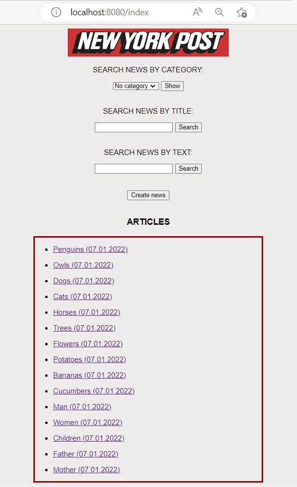

# spring-boot-news-app

### Spring Boot MVC app with frontend and backend

***Description:***

The application is a news website with the following features: 
creating, editing, and deleting articles, searching for news by title or text, 
and sorting articles by category.

***How to use:***

Create a new local "database" schema (I used MySQL), 
and add your username and password to the application.properties file.
Create the "NewsApplication" class run configuration in your IDE and start the Spring Boot Application. 
Link to resource: http://localhost:8080/index

***Tools used:***

Java  
Maven  
Spring Boot  
Thymeleaf  
FlyWay  
MySQL  
HTML  
CSS  
